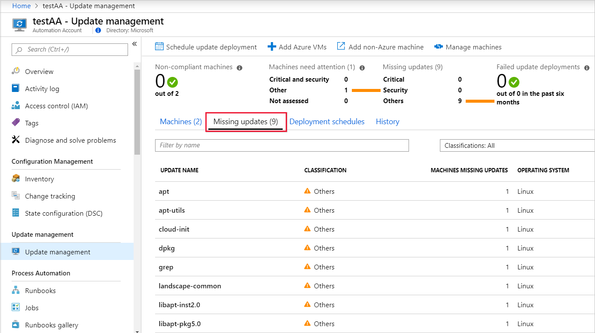

# View Azure Update Management update assessments

In your Automation account, select **Update Management** to view the status of your machines.

This view provides information about your machines, missing updates, update deployments, and scheduled update deployments. In the **COMPLIANCE COLUMN**, you can see the last time the machine was assessed. In the **UPDATE AGENT READINESS** column, you can see if the health of the update agent. If there's an issue, select the link to go to troubleshooting documentation that can help you learn what steps to take to correct the problem.

To run a log search that returns information about the machine, update, or deployment, select the item in the list. The **Log Search** pane opens with a query for the item selected:


## View missing updates

Select **Missing updates** to view the list of updates that are missing from your machines. Each update is listed and can be selected. Information about the number of machines that require the update, the operating system, and a link for more information is shown. The **Log search** pane shows more details about the updates.



## Update classifications

The following tables list the update classifications in Update Management, with a definition for each classification.

### Windows

|Classification  |Description  |
|---------|---------|
|Critical updates     | An update for a specific problem that addresses a critical, non-security-related bug.        |
|Security updates     | An update for a product-specific, security-related issue.        |
|Update rollups     | A cumulative set of hotfixes that are packaged together for easy deployment.        |
|Feature packs     | New product features that are distributed outside a product release.        |
|Service packs     | A cumulative set of hotfixes that are applied to an application.        |
|Definition updates     | An update to virus or other definition files.        |
|Tools     | A utility or feature that helps complete one or more tasks.        |
|Updates     | An update to an application or file that currently is installed.        |

### <a name="linux-2"></a>Linux

|Classification  |Description  |
|---------|---------|
|Critical and security updates     | Updates for a specific problem or a product-specific, security-related issue.         |
|Other updates     | All other updates that aren't critical in nature or aren't security updates.        |

For Linux, Update Management can distinguish between critical and security updates in the cloud while displaying assessment data due to data enrichment in the cloud. For patching, Update Management relies on classification data available on the machine. Unlike other distributions, CentOS does not have this information available out of the box. If you have CentOS machines configured in a way to return security data for the following command, Update Management will be able to patch based on classifications.

```bash
sudo yum -q --security check-update
```

There's currently no method supported method to enable native classification-data availability on CentOS. At this time, only best-effort support is provided to customers who may have enabled this on their own.

## Next Steps

After you view any update assessments you can schedule an Update Deployment by following the steps under [Manage updates and patches for your Azure VMs](automation-tutorial-update-management.md).