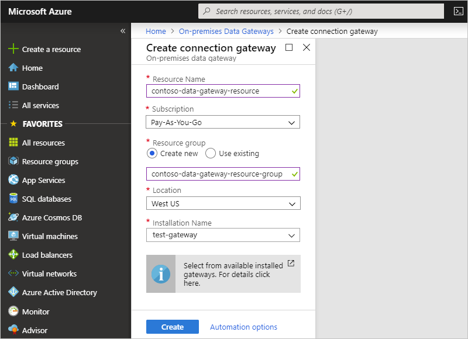
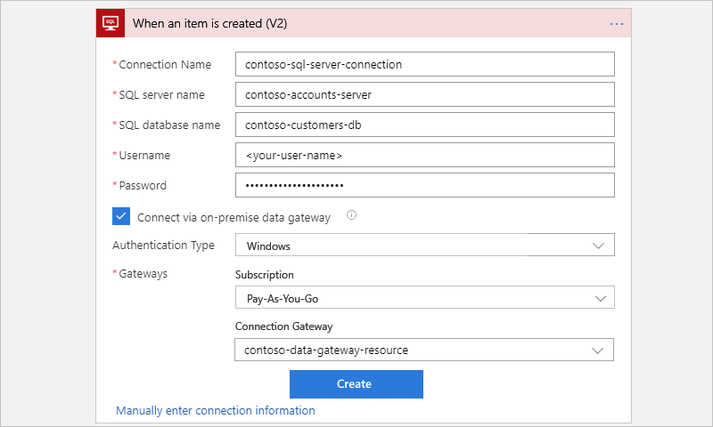

# Connect to on-premises data sources from Azure Logic Apps

Before you can access data sources on premises from your logic apps, you need to create an Azure resource after you [install the *on-premises data gateway* on a local computer](../logic-apps/logic-apps-gateway-install.md). Your logic apps then use this Azure gateway resource in the triggers and actions provided by the [on-premises connectors](../connectors/apis-list.md#on-premises-connectors) that are available for Azure Logic Apps.

This article shows how to create your Azure gateway resource for a previously [installed gateway on your local computer](../logic-apps/logic-apps-gateway-install.md). For more information about the gateway, see [How the gateway works](../logic-apps/logic-apps-gateway-install.md#gateway-cloud-service).

> [!TIP]
> To connect to Azure virtual networks, consider creating an 
> [*integration service environment*](../logic-apps/connect-virtual-network-vnet-isolated-environment-overview.md) instead. 

For information about how to use the gateway with other services, see these articles:

* [Microsoft Power BI on-premises data gateway](https://powerbi.microsoft.com/documentation/powerbi-gateway-onprem/)
* [Microsoft Flow on-premises data gateway](https://flow.microsoft.com/documentation/gateway-manage/)
* [Microsoft PowerApps on-premises data gateway](https://powerapps.microsoft.com/tutorials/gateway-management/)
* [Azure Analysis Services on-premises data gateway](../analysis-services/analysis-services-gateway.md)

## Supported data sources

In Azure Logic Apps, the on-premises data gateway supports the [on-premises connectors](../connectors/apis-list.md#on-premises-connectors) for these data sources:

* BizTalk Server 2016
* File System
* IBM DB2  
* IBM Informix
* IBM MQ
* MySQL
* Oracle Database
* PostgreSQL
* SAP
* SharePoint Server
* SQL Server
* Teradata

Azure Logic Apps supports read and write operations through the data gateway. However, these operations have [limits on their payload size](https://docs.microsoft.com/data-integration/gateway/service-gateway-onprem#considerations). Although the gateway itself doesn't incur additional costs, the [Logic Apps pricing model](../logic-apps/logic-apps-pricing.md) applies to these connectors and other operations in Azure Logic Apps.

## Prerequisites

* You already [installed the on-premises data gateway on a local computer](../logic-apps/logic-apps-gateway-install.md).

* You have the [same Azure account and subscription](../logic-apps/logic-apps-gateway-install.md#requirements) that was used when installing that data gateway.

* Your gateway installation isn't already registered and claimed by another Azure gateway resource.

  When you create a gateway resource in the Azure portal, you select a gateway installation, which links to your gateway resource and only that gateway resource. In Azure Logic Apps, on-premises triggers and actions then use the gateway resource for connecting to on-premises data sources. In these triggers and actions, you select your Azure subscription and the associated gateway resource that you want to use. Each gateway resource links to only one gateway installation, which links to only one Azure account.

## Create Azure gateway resource

After you install the gateway on a local computer, create the Azure resource for your gateway.

1. Sign in to the [Azure portal](https://portal.azure.com) with the same Azure account that was used to install the gateway.

1. In the Azure portal search box, enter "on-premises data gateway", and select **On-premises Data Gateways**.

   

1. Under **On-premises Data Gateways**, select **Add**.

   

1. Under **Create connection gateway**, provide this information for your gateway resource. When you're done, select **Create**.

   | Property | Description |
   |----------|-------------|
   | **Resource Name** | Provide a name for your gateway resource that contains only letters, numbers, hyphens (`-`), underscores (`_`), parentheses (`(`, `)`), or periods (`.`). |
   | **Subscription** | Select the Azure subscription for the Azure account that was used for the gateway installation. The default subscription is based on the Azure account that you used to sign in. |
   | **Resource group** | The [Azure resource group](../azure-resource-manager/resource-group-overview.md) that you want to use |
   | **Location** | The same region or location that was selected for the gateway cloud service during [gateway installation](../logic-apps/logic-apps-gateway-install.md). Otherwise, your gateway installation won't appear in the **Installation Name** list. Your logic app location can differ from your gateway resource location. |
   | **Installation Name** | Select a gateway installation, which appears in the list only when these conditions are met: 

- Exists in the same region as the gateway resource that you want to create  - Unlinked to another Azure gateway resource  - Linked to the same Azure account that you're using to create the gateway resource 

For more information, see the [Frequently asked questions](#faq) section. |
   |||

   Here is an example that shows a gateway installation that's in the same region as your gateway resource and is linked to the same Azure account:

   

## Connect to on-premises data

After you create your gateway resource and associate your Azure subscription with this resource, you can now create a connection between your logic app and your on-premises data source by using the gateway.

1. In the Azure portal, create or open your logic app in the Logic App Designer.

1. Add a connector that supports on-premises connections, for example, **SQL Server**.

1. Select **Connect via on-premises data gateway**.

1. Under **Gateways**, from the **Subscriptions** list, select your Azure subscription that has the gateway resource you want.

1. From the **Connection Gateway** list, which shows the available gateway resources in your selected subscription, select the gateway resource that you want. Each gateway resource is linked to a single gateway installation.

   > [!NOTE]
   > The gateways list includes gateway resources in other regions because your 
   > logic app's location can differ from your gateway resource's location. 

1. Provide a unique connection name and other required information, which depends on the connection that you want to create.

   A unique connection name helps you easily find that connection later, especially if you create multiple connections. If applicable, also include the qualified domain for your username.

   Here is an example:

   

1. When you're done, select **Create**.

Your gateway connection is now ready for your logic app to use.

## Edit connection

To update the settings for a gateway connection, you can edit your connection.

1. To find all the API connections for just your logic app, on your logic app's menu, under **Development Tools**, select **API connections**.

   

1. Select the gateway connection you want, and then select **Edit API connection**.

   > [!TIP]
   > If your updates don't take effect, try 
   > [stopping and restarting the gateway Windows service account](../logic-apps/logic-apps-gateway-install.md#restart-gateway) for your gateway installation.

To find all API connections associated with your Azure subscription:

* From the main Azure menu, go to **All services** > **Web** > **API Connections**.
* Or, from the main Azure menu, go to **All resources**. Set the **Type** filter to **API Connection**.

## Delete gateway resource

To create a different gateway resource, link your gateway installation to a different gateway resource, or remove the gateway resource, you can delete the gateway resource without affecting the gateway installation.

1. From the main Azure menu, select **All resources**. Find and select your gateway resource.

1. If not already selected, on your gateway resource menu, select **On-premises Data Gateway**. On the gateway resource toolbar, select **Delete**.

   For example:

   

## Frequently asked questions

**Q**: Why doesn't my gateway installation appear when I create my gateway resource in Azure?  
**A**: This issue can happen for these reasons:

* Your Azure account has to be the same account that's linked to the gateway installation on the local computer. Check that you're signed in to the Azure portal with the same identity that's linked to the gateway installation.

* Your gateway resource and gateway installation have to use the same region. However, your logic app location can differ from your gateway resource location.

* Your gateway installation is already registered and claimed by another gateway resource. These installations won't appear in the **Installation Name** list. To review your gateway registrations in the Azure portal, find all your Azure resources that have the **On-premises Data Gateways** type across *all* your Azure subscriptions. To unlink the gateway installation from the other gateway resource, see [Delete gateway resource](#change-delete-gateway-resource).

[!INCLUDE [existing-gateway-location-changed](../../includes/logic-apps-existing-gateway-location-changed.md)]

## Next steps

* [Secure your logic apps](./logic-apps-securing-a-logic-app.md)
* [Common examples and scenarios for logic apps](./logic-apps-examples-and-scenarios.md)
