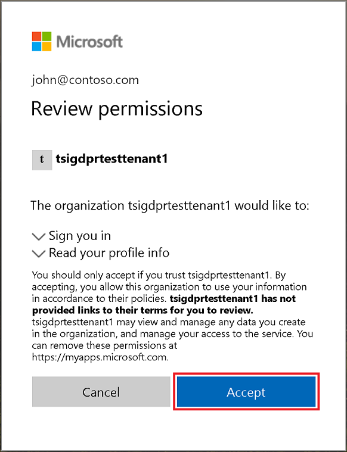

# Grant data access to an environment

This article discusses the two types of Azure Time Series Insights Preview access policies.

## Sign in to Time Series Insights

1. Sign in to the [Azure portal](https://portal.azure.com/).
1. Locate your Time Series Insights environment. Enter `Time Series` in the **Search** box. Select **Time Series Environment** in the search results.
1. Select your Time Series Insights environment from the list.

## Grant data access

Follow these steps to grant data access for a user principal.

1. Select **Data Access Policies**, and then select **+ Add**.

    

1. Choose **Select user**. Search for the user name or email address to locate the user you want to add. Select **Select** to confirm the selection.

    

1. Choose **Select role**. Choose the appropriate access role for the user:

    * Select **Contributor** if you want to allow the user to change reference data and share saved queries and perspectives with other users of the environment.

    * Otherwise, select **Reader** to allow the user to query data in the environment and save personal, not shared, queries in the environment.

   Select **OK** to confirm the role choice.

    

1. Select **OK** on the **Select User Role** page.

    

1. Confirm that the **Data Access Policies** page lists the users and the roles for each user.

    

## Provide guest access from another AAD tenant

`Guest` isn’t a management role. It’s a term used for an account that’s invited from one tenant to another. After the guest account is invited into the tenant’s directory, it can have the same access control applied to it like any other account. You can grant management access to a Time Series Insights Environment by using the Access Control (IAM) blade. Or you can grant access to the data in the environment through the Data Access Policies blade. For more information on Azure Active Directory (Azure AD) tenant guest access, read [Add Azure Active Directory B2B collaboration users in the Azure portal](https://docs.microsoft.com/azure/active-directory/b2b/add-users-administrator).

Follow these steps to grant guest access to a Time Series Insights environment to an Azure AD user from another tenant.

1. Select **Data Access Policies**, and then select **+ Invite**.

    

1. Enter the email address for the user you want to invite. This email address must be associated with Azure AD. You can optionally include a personal message with the invitation.

    

1. Look for the confirmation bubble that appears on the screen.

    

1. Choose **Select user**. Search for the email address of the guest user you invited to locate the user you want to add. Then, **Select** to confirm the selection.

    

1. Choose **Select role**. Choose the appropriate access role for the guest user:

    * Select **Contributor** if you want to allow the user to change reference data and share saved queries and perspectives with other users of the environment.

    * Otherwise, select **Reader** to allow the user to query data in the environment and save personal, not shared, queries in the environment.

   Select **OK** to confirm the role choice.

    

1. Select **OK** on the **Select User Role** page.

1. Confirm that the **Data Access Policies** page lists the guest user and the roles for each guest user.

    

1. Now the guest user must follow steps to access the environment located in the Azure tenant to which you invited them. First, they accept the invitation you sent them. This invitation is sent via email to the email address you used in step 5. They select **Get Started** to accept.

    

1. Next, the guest user accepts the permissions associated with the admin's organization.

    

1. After the guest user is signed in to the email address you used to invite them, and they accept the invitation, they go to insights.azure.com. Once there, they select the avatar next to their email address in the upper-right corner of the screen.

    

1. Next, the guest user selects your Azure tenant from the directory drop-down menu. This tenant is the one to which you invited them.

    

After the guest user selects your tenant, they see the Time Series Insights environment to which you provided them access. They now have all the capabilities associated with the role that you provided them with in **step 5**.

## Next steps

* Learn [how to add an Azure Event Hubs event source](./time-series-insights-how-to-add-an-event-source-eventhub.md) to your Time Series Insights environment.

* Send [events to the event source](./time-series-insights-send-events.md).

* View [your environment in the Time Series Insights Preview explorer](./time-series-insights-update-explorer.md).
